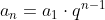
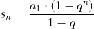
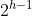
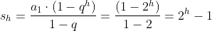
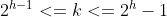
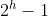
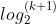

# 二叉树和递归

> - [公式编辑器](https://www.codecogs.com/latex/eqneditor.php)
> - 参考[二叉树操作（面试必备）](https://segmentfault.com/a/1190000008850005)

## 二叉树

等比数列 

通项公式 

求和公式 

定义：二叉树的高度为h，总节点为k。

### 特殊

#### 满二叉树

树的每一层都是最大节点数，就是一个等比数列，每层的节点都为，总节点数为

#### 完全二叉树

除最后一层外，其余层都是满的，且最后一层要么是满的，要么是在右边缺少连续节点。

|         | 完全二叉树                                                 | 满二叉树                                     |
| ------- | ---------------------------------------------------------- | -------------------------------------------- |
| 总节点k |  |  |
| 树高h   |              |        |

知识点：

前序遍历列表：第一个元素永远是 【根节点 (root)】
中序遍历列表：根节点 (root)【左边】的所有元素都在根节点的【左分支】，【右边】的所有元素都在根节点的【右分支】
算法思路：

通过【前序遍历列表】确定【根节点 (root)】
将【中序遍历列表】的节点分割成【左分支节点】和【右分支节点】
递归寻找【左分支节点】中的【根节点 (left child)】和 【右分支节点】中的【根节点 (right child)】

### 节点定义

每个节点有三个属性，首先是该节点的值，然后是该节点的左节点和右节点。

```java
class TreeNode {
    int val;
    TreeNode left;
    TreeNode right;

    TreeNode() {
    }

    TreeNode(int val) {
        this.val = val;
    }

    TreeNode(int val, TreeNode left, TreeNode right) {
        this.val = val;
        this.left = left;
        this.right = right;
    }
}
```

### 遍历
#### 深度优先遍历

##### 前序遍历
对于当前结点，先输出该结点，然后输出它的左孩子，最后输出它的右孩子
```java
void preorder(TreeNode root){
        if(root==null) {
        return;
        }
        System.out.print(root.val);
        preorder(root.left);
        preorder(root.right);
        }
        // 前序遍历 非递归
        void preorderNonRec(TreeNode root) {
        if(root == null) {
        return;
        }
        System.out.println("前序遍历非递归");
        Stack<TreeNode> s = new Stack<>();
        while(!s.empty()||root!=null) {// 栈中有元素或者root还是节点
        while(root!=null) {
        System.out.print(root.val); // 输出当前节点
        s.push(root);
        root = root.left; // 然后输出左孩子
        } // 循环结束 左孩子输出结束
        root = s.pop().right; // 输出右孩子

        }
        }
```

##### 中序遍历
对于当前结点，先输出它的左孩子，然后输出该结点，最后输出它的右孩子
```java
// 中序遍历 递归
    void inorder(TreeNode root){
            if(root==null) {
            return;
            }
            inorder(root.left);
            System.out.print(root.val);
            inorder(root.right);
            }
            // 中序遍历 非递归
            void inorderNonRec(TreeNode root) {
            if(root == null) {
            return;
            }
            System.out.println("中序遍历非递归");
            Stack<TreeNode> s = new Stack<>();
        while(!s.empty()||root!=null) {
        while(root!=null) {
        s.push(root);
        root = root.left;
        } // 循环结束 左孩子输出结束
        System.out.print(s.peek().val); // 左孩子输出完毕 接着输出当前节点
        root = s.pop().right;
        }
        }
```

##### 后序遍历
对于当前结点，先输出它的左孩子，然后输出它的右孩子，最后输出该结点
```java
// 后序遍历 递归
    void postorder(TreeNode root){
            if(root==null) {
            return;
            }
            postorder(root.left);
            postorder(root.right);
            System.out.print(root.val);
            }
```
#### 广度优先遍历
todo
### 转换

#### 数组生成二叉树
广度优先遍历数组生成二叉树，对于节点i（从0开始），在数组中为位置为`2*i`，左节点为`2*i+1`，右节点为`2*i+2`。

```java
TreeNode createTree(Integer[] nums) {
    if(nums==null) {
        return null;
    }
    return createNode(nums,0);
}

TreeNode createNode(Integer[] nums,int index){
        // index超出数组长度 返回null
        if(index>nums.length-1) {
            return null;
        }
        // index为1时创建跟节点
        Integer value = nums[index];
        if(value == null) {
            return null;
        }
        TreeNode node=new TreeNode(value);
        node.left=createNode(nums,2*index+1);
        node.right=createNode(nums,2*index+2);
        return node;
}

```